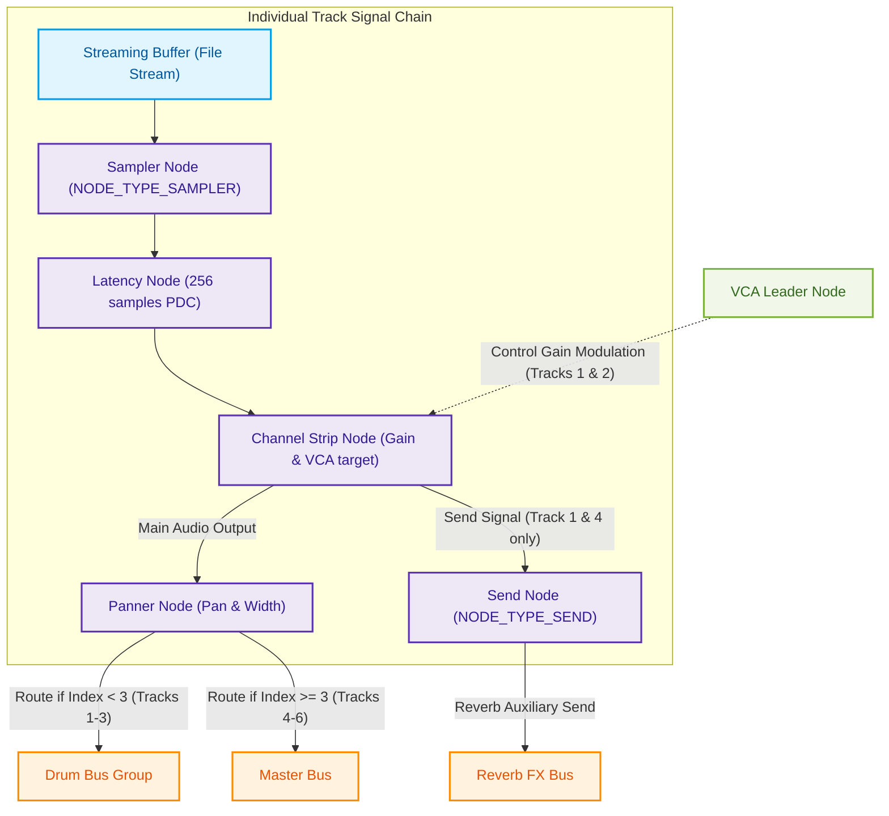
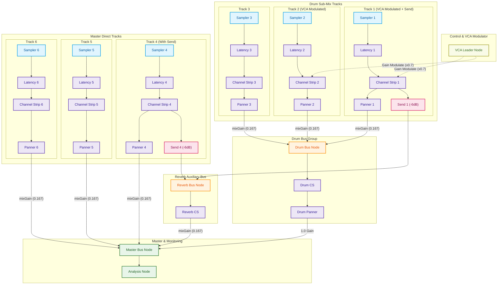

An analysis of the C++ unit test file [real_multi_audio_roundtrip_test.cpp](file:///Users/goldenfung/Documents/agent-based-daw/tests/unit/Media%20management/real_multi_audio_roundtrip_test.cpp) has been completed. 

This test validates the **Real-World Audio Summing: Multi-Input Mix** pipeline, which is a major end-to-end integration test spanning Layer 1 to Layer 6 of the DAW's architecture. It constructs a complete Directed Acyclic Graph (DAG) for a multi-track audio session, performs a synchronous offline export render, and mathematically verifies that the summed result perfectly matches the theoretical summing formula (achieving an aligned correlation of $> 0.9999$ and RMS error $< 0.0001$).

Below is the detailed breakdown of both the **Individual Track Chaining** and the **Global Graph Routing Topology** with accompanying Mermaid visualizations.

---

### 1. Individual Track Chaining

Each of the 6 tracks in the test undergoes an identical initialization pipeline to form a contiguous processor chain. 

#### Pipeline Stages
1. **Streaming Buffer (`IStreamingBuffer`)** [Layer 3 - Core Audio Engine]: Loads the 24-bit PCM WAV audio file chunks in real-time or via pre-buffering.
2. **Sampler Node (`NODE_TYPE_SAMPLER`)** [Layer 4 - DSP Processing Nodes]: Reads from the stream buffer and triggers voice playback.
3. **Latency Node (`NODE_TYPE_LATENCY`)** [Layer 4 - DSP Processing Nodes]: Simulates a Plugin Delay Compensation (PDC) offset. In this test, every track chain has a fixed latency of **256 samples** injected.
4. **Channel Strip Node (`NODE_TYPE_CHANNEL_STRIP`)** [Layer 4 - DSP Processing Nodes]: Provides individual gain controls. For Tracks 1 & 2, this stage is modulated by an external **VCA Leader** control node.
5. **Send Node (`NODE_TYPE_SEND`)** [Layer 4 - DSP Processing Nodes]: (Optional) Injected into **Tracks 1 and 4** to split and route audio to an auxiliary Reverb FX bus at `-6dB` (`0.5f` gain).
6. **Panner Node (`NODE_TYPE_PANNER`)** [Layer 4 - DSP Processing Nodes]: Handles spatial placement using a linear balance panning mode.

#### Mermaid Diagram: Individual Track Chain

---

### 2. Global Routing Topology

The global routing topology organizes the 6 individual tracks, sums them into sub-buses, feeds an effects routing bus, and routes the final mix to the master output.

#### Global Graph Nodes & Summing Nodes
- **VCA Leader**: Operates as a control node (no audio routing) to dynamically scale the gain of the channel strips of **Track 1 & Track 2** by `0.7f`.
- **Drum Bus Group**: A sub-mix bus that aggregates **Tracks 1, 2, and 3**. 
  $$\text{Drum Bus} \rightarrow \text{Drum Channel Strip} \rightarrow \text{Drum Panner} \rightarrow \text{Master Bus}$$
- **Reverb FX Bus**: An auxiliary bus that sums the send outputs of **Track 1** and **Track 4**. 
  $$\text{Reverb Bus} \rightarrow \text{Reverb Channel Strip} \rightarrow \text{Master Bus}$$
- **Master Bus**: Sums the outputs of the **Drum Bus**, the **Reverb FX Bus**, and the direct outputs of **Tracks 4, 5, and 6**.
- **Analysis Node**: The terminal node connected to the Master Bus to measure and capture output levels.

#### Mermaid Diagram: Global DAG Routing Graph

---

### 3. Verification & Alignment

The test performs a detailed signal analysis comparison to verify correct implementation of the graph routing and summing code:

1. **Topology Swapping & Warm-up**: The test pushes state modifications (`MutationType::NODE_ADD` and `MutationType::NODE_CONNECT`) to the mutation bridge and processes dummy contexts to execute a lock-free RCU (Read-Copy-Update) topology swap in the `IDSPKernel`.
2. **Offline Rendering**: By setting `config.endSample = maxTotalSamples`, it triggers an asynchronous export operation. The main thread calls `track.buffer->refillAsync(...)` to ensure streaming buffers are synchronously replenished during offline processing.
3. **PDC Alignment**: Because the Latency Node introduces a exact 256-sample delay, the test aligns the expected signal (computed using mathematical equations) and the actual output WAV by introducing a `latencyFrames` offset before computing cross-correlation and root-mean-square (RMS) error:
   $$\text{offset} = 256\text{ frames}$$
4. **Signal Mathematical Summing Equivalence**: 
   The code computes the expected amplitude for every single frame $f$ as:
   - For Tracks 1 & 2: Apply a $0.7$ gain multiplier.
   - For Tracks 1 & 4: Split a $-6\text{dB}$ ($0.5$) sidechain send into the Reverb Bus.
   - For Tracks 1, 2, & 3: Route through the Drum Bus (scaled by $\frac{1}{6}$ mix gain) and then through the Drum Panner.
   - For Tracks 4, 5, & 6: Route directly to the Master Bus (scaled by $\frac{1}{6}$ mix gain).
   - Reverb Bus: Routed to the Master Bus (scaled by $\frac{1}{6}$ mix gain).

By verifying that the generated audio file strictly corresponds to this pipeline, the test ensures that the multithreaded DSP engine's DAG routing, panning matrix, sends, VCA modulations, and PDC sub-systems perform with sample-accurate precision.